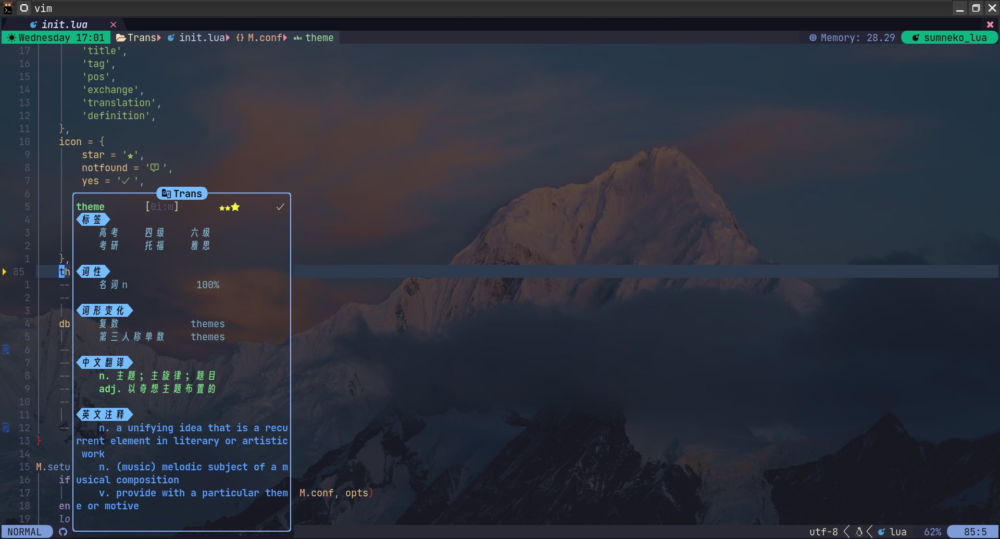
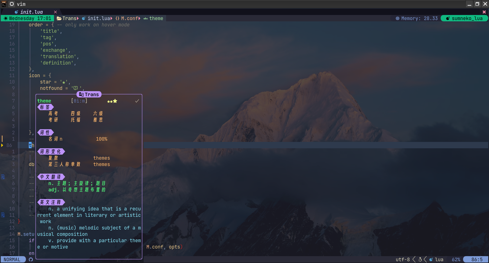
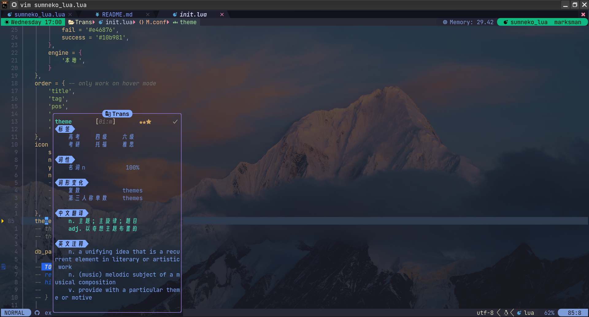

# Trans.nvim

<!--toc:start-->

-   [Trans.nvim](#transnvim) - [注意: 当前分支目前没有发布, README.md 的描述并不准确, 遇到问题请切换到 `main`分支或者联系我](#注意-当前分支目前没有发布-readmemd-的描述并不准确-遇到问题请切换到-main分支或者联系我)
    -   [特点](#特点)
    -   [屏幕截图](#屏幕截图)
        -   [演示](#演示)
        -   [离线查询](#离线查询)
        -   [\*在线查询\*\* (有道)](#在线查询-有道)
        -   [主题](#主题)
    -   [安装](#安装)
    -   [配置](#配置)
    -   [高亮组](#高亮组)
    -   [声明](#声明)
    -   [感谢](#感谢)
    -   [贡献](#贡献)
    -   [待办 (画大饼)](#待办-画大饼)
    -   [项目情况](#项目情况)
    <!--toc:end-->

### 注意: 当前分支目前没有发布, README.md 的描述并不准确, 遇到问题请切换到 `main`分支或者联系我

## 特点

-   使用纯 lua 编写, 速度极快

    > `Lazy.nvim`的记录: <font color="#0099FF">`➜   Trans.nvim 0.82ms`</font>

-   **可以定义快捷键读英文单词**

    > 见 wiki

-   大部分功能可以自定义:
    -   高亮
    -   悬浮大小
    -   排版顺序
    -   弹窗大小
    -   `舒服窗口动画`
    -   etc (更多可以查看[配置](#配置))
-   **完全离线** 的单词翻译体验 (可能后面会支持在线翻译)
-   支持显示:
    -   柯林斯星级
    -   牛津 3000 词汇
    -   中文翻译
    -   英文翻译 (不是英译中, 而是用英文解释)
    -   词根
    -   etc
-   舒服的排版和`动画`
-   支持 `normal`和 `visual`模式
    > <font color='#FF9900'>不支持 visual-block mode</font>
-   本地词库单词量: `430w`

## 屏幕截图

### 演示

> 可以点开声音查看离线自动发音

### 离线查询

https://user-images.githubusercontent.com/107862700/226175984-1a95bea7-8d66-450e-87e1-ba9c91c37ab8.mp4

### 在线查询 (有道)

https://user-images.githubusercontent.com/107862700/226176106-c2962dd3-d66c-499c-b44a-1f471b79fe38.mp4

**使用在线查询需要配置相应的 app_id 和 app_passwd**

在线查询配置见: [wiki](https://github.com/JuanZoran/Trans.nvim/wiki/%E9%85%8D%E7%BD%AE#%E5%9C%A8%E7%BA%BF%E6%9F%A5%E8%AF%A2%E9%85%8D%E7%BD%AE)

### 主题

> 如果你有更美观或者更适合的配色, 欢迎提 PR  
> 主题配色在: `lua/Trans/theme.lua`文件中，你只需要添加你主题的表就可以了

-   `default`
    

-   `dracula`
    

-   `tokyonight`
    

## 安装

_安装之前, 首先需要明确本插件的依赖:_

-   [ECDICT](https://github.com/skywind3000/ECDICT): 插件所用的离线单词数据库
-   [sqlite.lua](https://github.com/kkharji/sqlite.lua): 操作数据库所用的库
-   sqlite3: 数据库

<details>
    <summary>Packer.nvim</summary>

```lua
use {
    'JuanZoran/Trans.nvim'
    run = function() require('Trans').install() end, -- 自动下载使用的本地词库
    requires =  'kkharji/sqlite.lua', ,
    -- 如果你不需要任何配置的话, 可以直接按照下面的方式启动
    config = function ()
        require'Trans'.setup{
            -- your configuration here
        }
    end
}
```

**如果你想要使用 Packer 的惰性加载，这里有一个例子**

```lua
use {
    "JuanZoran/Trans.nvim",
    keys = {
        { {'n', 'x'}, 'mm' }, -- 换成其他你想用的key即可
        { {'n', 'x'}, 'mk' },
        { 'n', 'mi' },
    },
    run = function() require('Trans').install() end, -- 自动下载使用的本地词库
    requires = { 'kkharji/sqlite.lua',  },
    config = function()
        require("Trans").setup {
            -- your configuration here
        }
        vim.keymap.set({"n", 'x'}, "mm", '<Cmd>Translate<CR>') -- 自动判断visual 还是 normal 模式
        vim.keymap.set({'n', 'x'}, 'mk', '<Cmd>TransPlay<CR>') -- 自动发音选中或者光标下的单词
        vim.keymap.set('n', 'mi', '<Cmd>TransInput<CR>')
    end
}
```

</details>

<details>
    <summary>Lazy.nvim</summary>

```lua
    {
        "JuanZoran/Trans.nvim",
        keys = {
        -- 可以换成其他你想映射的键
            { 'mm', mode = { 'n', 'x' }, '<Cmd>Translate<CR>', desc = ' Translate' },
            { 'mk', mode = { 'n', 'x' }, '<Cmd>TransPlay<CR>', desc = ' Auto Play' },
            -- 目前这个功能的视窗还没有做好，可以在配置里将view.i改成hover
            { 'mi', '<Cmd>TranslateInput<CR>', desc = ' Translate From Input' },
        },
        dependencies = { 'kkharji/sqlite.lua', },
        opts = {
            -- your configuration there
        }
    }
```

</details>

<font color="#FF9900">**注意事项**: </font>

-   `install.sh`

    -   使用了 `wget`下载词库, 安装请确保你的环境变量中存在 wget
    -   install.sh 下载后会自动将词库解压, 并移动到 `$HOME/.vim/dict`文件夹下
    -   目前仅在 `Ubuntu22.04`的环境下测试通过
        > 如果上述条件不符合, 请删掉 `run = 'install.sh'`部分, 考虑手动安装词库
        > 如果上述条件满足, 仍出现问题, 欢迎在 issue 里向我反馈,我会及时尝试解决

-   下载词典的过程中, 需要能够 `流畅的访问github下载`

    > 词库文件压缩包大小为: **281M**
    > 解压缩后的大小大概为: 1.2G

-   安装后如果不能正常运行, 请尝试检查一下问题:

    -   本机是否已经安装了 `sqlite3`
        > Linux 下安装:
        > `sudo pacman -S sqlite # Arch`  
        > `sudo apt-get install sqlite3 libsqlite3-dev # Ubuntu`

    > **尝试运行 `checkhealth Trans`**

-   **`auto_play`** 使用步骤:

    > linux 只需要安装`festival`  
    > sudo apt-get install festival festvox-kallpc16k  
    > **_如果你想要设置音色，发音可以访问:_** [Festival 官方](https://www.cstr.ed.ac.uk/projects/festival/morevoices.html)  
    > 可以选择英音、美音、男声、女声

    > 其他操作系统

    -   需要确保安装了`nodejs`
    -   进入插件的`tts`目录运行`npm install`
        > 如果`install`运行正常则自动安装，如果安装失败，请尝试手动安装

-   `title`的配置，只对`neovim 0.9+`版本有效

<details>
    <summary>Festival配置(仅针对linux用户)</summary>
- 配置文件
    - 全局配置: `/usr/share/festival/siteinit.scm`
    - 用户配置: `~/.festivalrc`

-   更改声音

    -   在 festival 的 voices 文件内建立自己的文件夹

        > 一般其默认配置目录在`/usr/share/festival/voices`

        示例:

        > `sudo mkdir /usr/share/festival/voices/my_voices`

    -   下载想要的 voices 文件并解压

        > 可能需要 

        -   试听[在这里](https://www.cstr.ed.ac.uk/projects/festival/morevoices.html))
        -   下载[在这里](http://festvox.org/packed/festival/2.5/voices/))
            > 假设下载的文件在`Downloads`文件夹, 下载的文件为:`festvox_cmu_us_aew_cg.tar.gz`

        示例:

        > `cd ~/Downloads && tar -xf festvox_cmu_us_aew_cg.tar.gz`

    -   将音频文件拷贝到 festival 文件夹
        示例:

        > `sudo cp -r festival/lib/voices/us/cmu_us_aew_cg/ /usr/share/festival/voices/my_voices/`

    -   在配置文件中设置默认的声音
        示例:

        > 加入`(set! voice_default voice_cmu_indic_hin_ab_cg)`到配置文件

    -   安装完成

-   相关说明网站
    > 可能需要 
    -   [wiki](https://archlinux.org/packages/community/any/festival-us/) 查看更多详细配置
    -   [官方网站](http://festvox.org/dbs/index.html)
    -   [用户手册](http://www.festvox.org/docs/manual-2.4.0/festival_toc.html)

</details>

## 配置

详细见**wiki**: [配置说明](https://github.com/JuanZoran/Trans.nvim/wiki/%E9%85%8D%E7%BD%AE)

```lua
require 'Trans'.setup {
    ---@type string the directory for database file and password file
    dir      = require 'Trans'.plugin_dir,
    ---@type 'default' | 'dracula' | 'tokyonight' global Trans theme [see lua/Trans/style/theme.lua]
    theme    = 'default', -- default | tokyonight | dracula
    strategy = {
        ---@type { frontend:string, backend:string | string[] } fallback strategy for mode
        default = {
            frontend = 'hover',
            backend = '*',
        },
    },
    ---@type table frontend options
    frontend = {
        ---@class TransFrontendOpts
        ---@field keymaps table<string, string>
        default = {
            query     = 'fallback',
            border    = 'rounded',
            title     = vim.fn.has 'nvim-0.9' == 1 and {
                    { '',       'TransTitleRound' },
                    { ' Trans', 'TransTitle' },
                    { '',       'TransTitleRound' },
                } or nil, -- need nvim-0.9+
            auto_play = true,
            ---@type {open: string | boolean, close: string | boolean, interval: integer} Hover Window Animation
            animation = {
                open = 'slid', -- 'fold', 'slid'
                close = 'slid',
                interval = 12,
            },
            timeout   = 2000,
        },
        ---@class TransHoverOpts : TransFrontendOpts
        hover = {
            ---@type integer Max Width of Hover Window
            width             = 37,
            ---@type integer Max Height of Hover Window
            height            = 27,
            ---@type string -- see: /lua/Trans/style/spinner
            spinner           = 'dots',
            ---@type string
            fallback_message  = '{{notfound}} 翻译超时或没有找到相关的翻译',
            auto_resize       = true,
            split_width       = 60,
            padding           = 10, -- padding for hover window width
            keymaps           = {
                pageup       = '[[',
                pagedown     = ']]',
                pin          = '<leader>[',
                close        = '<leader>]',
                toggle_entry = '<leader>;',
                -- play         = '_', -- Deprecated
            },
            ---@type string[] auto close events
            auto_close_events = {
                'InsertEnter',
                'CursorMoved',
                'BufLeave',
            },
            ---@type table<string, string[]> order to display translate result
            order             = {
                default = {
                    'str',
                    'translation',
                    'definition',
                },
                offline = {
                    'title',
                    'tag',
                    'pos',
                    'exchange',
                    'translation',
                    'definition',
                },
                youdao = {
                    'title',
                    'translation',
                    'definition',
                    'web',
                },
            },
            icon              = {
                -- or use emoji
                list        = '●', -- ● | ○ | ◉ | ◯ | ◇ | ◆ | ▪ | ▫ | ⬤ | 🟢 | 🟡 | 🟣 | 🟤 | 🟠| 🟦 | 🟨 | 🟧 | 🟥 | 🟪 | 🟫 | 🟩 | 🟦
                star        = '', -- ⭐ | ✴ | ✳ | ✲ | ✱ | ✰ | ★ | ☆ | 🌟 | 🌠 | 🌙 | 🌛 | 🌜 | 🌟 | 🌠 | 🌌 | 🌙 |
                notfound    = ' ', --❔ | ❓ | ❗ | ❕|
                yes         = '✔', -- ✅ | ✔️ | ☑
                no          = '', -- ❌ | ❎ | ✖ | ✘ | ✗ |
                cell        = '■', -- ■  | □ | ▇ | ▏ ▎ ▍ ▌ ▋ ▊ ▉
                web         = '󰖟', --🌍 | 🌎 | 🌏 | 🌐 |
                tag         = '',
                pos         = '',
                exchange    = '',
                definition  = '󰗊',
                translation = '󰊿',
            },
        },
    },
}
```

## 快捷键绑定

**示例:**

> 示例中展示, 将`mm`映射成快捷键

```lua
vim.keymap.set('n', 'mi', '<Cmd>TranslateInput<CR>')
vim.keymap.set({'n', 'x'}, 'mm', '<Cmd>Translate<CR>')
vim.keymap.set({'n', 'x'}, 'mk', '<Cmd>TransPlay<CR>') -- 自动发音选中或者光标下的单词
```

## 高亮组

> 默认定义

```lua
{
        TransWord = {
            fg = '#7ee787',
            bold = true,
        },
        TransPhonetic = {
            link = 'Linenr'
        },
        TransTitle = {
            fg = '#0f0f15',
            bg = '#75beff',
            bold = true,
        },
        TransTitleRound = {
            fg = '#75beff',
        },
        TransTag = {
            -- fg = '#e5c07b',
            link = '@tag'
        },
        TransExchange = {
            link = 'TransTag',
        },
        TransPos = {
            link = 'TransTag',
        },
        TransTranslation = {
            link = 'TransWord',
        },
        TransDefinition = {
            link = 'Moremsg',
        },
        TransWin = {
            link = 'Normal',
        },
        TransBorder = {
            fg = '#89B4FA',
        },
        TransCollins = {
            fg = '#faf743',
            bold = true,
        },
        TransFailed = {
            fg = '#7aa89f',
        },
        TransWaitting = {
            link = 'MoreMsg'
        },
        TransWeb = {
            -- TODO :
            link = 'MoreMsg',
        }
    }
```

## 声明

-   本插件词典基于[ECDICT](https://github.com/skywind3000/ECDICT)

## 感谢

-   [ECDICT](https://github.com/skywind3000/ECDICT) 本地词典的提供
-   [sqlite.lua](https://github.com/kharji/sqlite.lua) 数据库访问
-   [T.vim](https://github.com/sicong-li/T.vim) 灵感来源

## 贡献

> 更新比较频繁, 文档先鸽了  
> 如果你想要参加这个项目, 可以提 issue, 我会把文档补齐

## 待办 (画大饼)

-   [x] 快捷键定义
-   [x] 自动读音
-   [x] 在线多引擎异步查询
-   [x] `句子翻译` | `中翻英` 的支持
-   [ ] 迁移文档
-   [ ] 多风格样式查询
-   [ ] 重新录制屏幕截图示例
-   [ ] 变量命名的支持
-   [ ] 历史查询结果保存

## 项目情况

[](https://star-history.com/#JuanZoran/Trans.nvim&Date)
